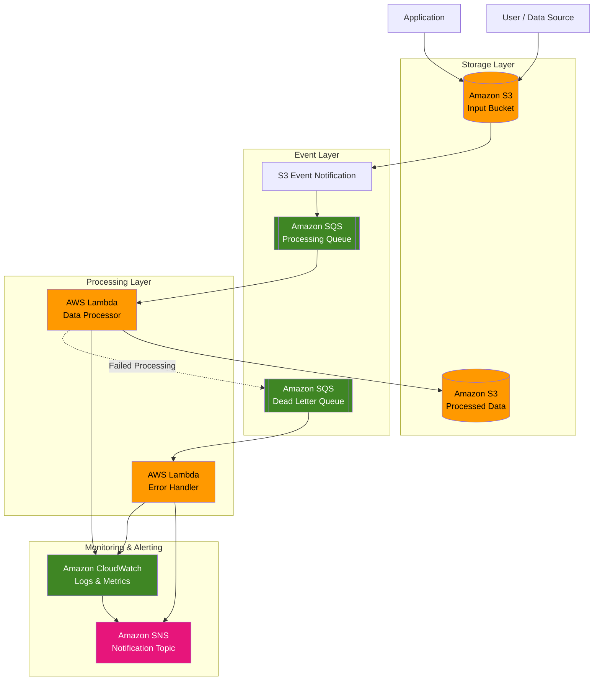

# Automated S3 Event Processing with AWS

An event-driven data processing pipeline that automatically detects new files uploaded to Amazon S3, processes them using AWS Lambda, and provides reliable error handling and notifications using Amazon SQS, SQS Dead Letter Queues, and Amazon SNS.

## 📌 Problem

Data processing teams often rely on manually triggered pipelines whenever new files arrive. This creates delays, increases operational overhead, and can result in inconsistent processing times.

Organizations need a reliable way to automatically detect new files and trigger processing workflows immediately after upload.

## 💡 Solution

This project implements an event-driven AWS architecture where:

1. A user or application uploads a file to an Amazon S3 bucket.
2. S3 generates an object-created event.
3. The event is sent to an Amazon SQS queue.
4. AWS Lambda consumes messages from SQS.
5. The Lambda function validates and processes the uploaded file.
6. Successfully processed data is stored in an output location.
7. Failed messages are automatically retried.
8. Messages that repeatedly fail are moved to an SQS Dead Letter Queue (DLQ).
9. A separate error-handling Lambda processes DLQ messages.
10. Amazon SNS sends notifications when failures occur.

This architecture removes the need for manual monitoring and provides a more reliable, scalable, and fault-tolerant processing workflow.

## 🏗️ Architecture



## 📁 Project Structure

```text
automated-s3-event-processing/
│
├── README.md
│
├── infrastructure/
│   ├── s3/
│   │   └── bucket.tf
│   │
│   ├── lambda/
│   │   ├── processing_lambda.tf
│   │   └── error_handler_lambda.tf
│   │
│   ├── sqs/
│   │   ├── processing_queue.tf
│   │   └── dead_letter_queue.tf
│   │
│   ├── sns/
│   │   └── notification_topic.tf
│   │
│   ├── iam/
│   │   └── roles.tf
│   │
│   └── main.tf
│
├── src/
│   ├── data_processor/
│   │   ├── handler.py
│   │   ├── processor.py
│   │   └── requirements.txt
│   │
│   └── error_handler/
│       ├── handler.py
│       └── requirements.txt
│
├── tests/
│   ├── test_data_processor.py
│   └── test_error_handler.py
│
├── events/
│   └── s3_event.json
│
├── scripts/
│   ├── deploy.sh
│   └── upload_test_file.sh
│
└── docs/
    ├── architecture.md
    └── deployment.md
```


## 🚀 Deployment

The infrastructure can be deployed using Terraform.

Example workflow:

```bash
terraform init

terraform plan

terraform apply
```

After deployment, upload a test file to the S3 input bucket and monitor the Lambda execution through CloudWatch.

## 📈 Benefits

This architecture provides:

* **Automation** — Files are processed immediately after upload.
* **Scalability** — SQS and Lambda can handle varying workloads.
* **Reliability** — Failed messages can be retried automatically.
* **Fault isolation** — Failed events are separated into a DLQ.
* **Monitoring** — CloudWatch provides logs and metrics.
* **Alerting** — SNS provides notifications for important failures.
* **Loose coupling** — S3 does not need to directly manage Lambda processing.
* **Cost efficiency** — Serverless services operate without continuously running servers.

## 🔮 Future Improvements

Possible extensions include:

* Add AWS Step Functions for multi-stage workflows.
* Add Amazon DynamoDB for processing metadata.
* Add S3 versioning.
* Add encryption using AWS KMS.
* Add CloudWatch dashboards.
* Add automated CI/CD deployment.
* Add data validation and schema checking.
* Add separate processing queues for different file types.
* Add automated DLQ replay functionality.

## 🏁 Conclusion

This project demonstrates how AWS serverless and event-driven services can be combined to create an automated and reliable data processing pipeline.

Instead of manually monitoring an S3 bucket, the system automatically detects new files, queues processing events, invokes Lambda functions, handles failures through SQS and a Dead Letter Queue, and sends alerts through SNS.

The resulting architecture is scalable, fault-tolerant, and suitable as a foundation for production-grade event-driven data processing systems.
