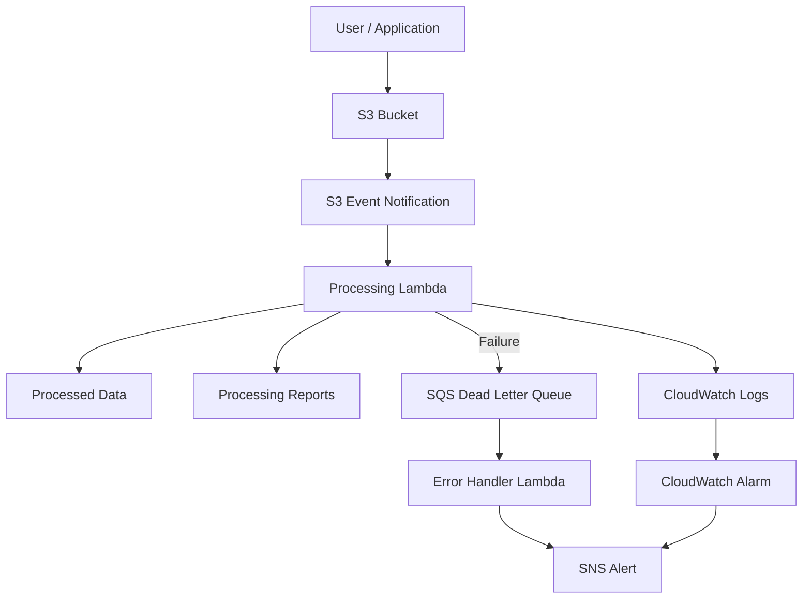

# Automated Processing with S3 Event Triggers

An event-driven AWS architecture for automatically processing files when they are uploaded to an Amazon S3 bucket.

## Overview

This project uses **Amazon S3 event notifications** to automatically trigger **AWS Lambda** when a new file is uploaded to an S3 bucket.

Instead of polling the bucket manually or relying on scheduled jobs, S3 generates an event when a matching object is created. The event triggers the processing Lambda, which performs the required file-processing operations.

For reliability and observability, the architecture also incorporates:

* **Amazon SQS** as a Dead Letter Queue (DLQ) for failed processing events
* **Amazon SNS** for notifications and alerts
* **Amazon CloudWatch** for logging, monitoring, and alarms

This creates a scalable, event-driven file-processing pipeline with built-in error handling and monitoring.

## Architecture



## How It Works

1. A user or application uploads a file to the S3 bucket.
2. Amazon S3 detects the object creation event.
3. The S3 event notification evaluates the configured filtering rules, such as:

   * Object prefix
   * File suffix or type
   * Object creation event
4. If the event matches the configured rules, S3 triggers the **Processing Lambda**.
5. The Lambda function retrieves and processes the file.
6. Processed data and processing reports are written to the required destinations.
7. Processing logs are written to **Amazon CloudWatch**.
8. If processing fails and the configured retry attempts are exhausted, the failed event can be routed to the **SQS Dead Letter Queue**.
9. The **Error Handler Lambda** consumes failed events from the DLQ and publishes an alert through **Amazon SNS**.
10. **CloudWatch Alarms** can monitor Lambda metrics and notify the team when predefined thresholds are exceeded.

## Project Structure

```text
.
├── infrastructure/
│   ├── cloudwatch/
│   │   ├── main.tf
│   │   └── variables.tf
│   │
│   ├── iam/
│   │   ├── outputs.tf
│   │   ├── roles.tf
│   │   └── variable.tf
│   │
│   ├── lambda/
│   │   ├── error_handler_lambda.tf
│   │   ├── output.tf
│   │   ├── processing_lambda.tf
│   │   └── variable.tf
│   │
│   ├── s3/
│   │   ├── bucket.tf
│   │   ├── outputs.tf
│   │   └── variables.tf
│   │
│   ├── sns/
│   │   ├── notification_topic.tf
│   │   ├── outputs.tf
│   │   └── variables.tf
│   │
│   ├── sqs/
│   │   ├── dead_letter_queue.tf
│   │   ├── outputs.tf
│   │   ├── processing_queue.tf
│   │   └── variables.tf
│   │
│   ├── main.tf
│   ├── variables.tf
│   └── version.tf
│
├── src/
│   ├── data_processor/
│   │   └── handler.py
│   │
│   └── error_handler/
│       └── handler.py
│
└── README.md
```
    |

## Event Filtering

S3 event notifications can be configured with filters so that Lambda is triggered only for relevant objects.

For example:

```text
incoming/
├── customers/
│   └── customers.csv
├── orders/
│   └── orders.csv
└── images/
    └── photo.jpg
```

The Lambda trigger could be configured to process only CSV files uploaded under the `incoming/orders/` prefix:

```text
Prefix: incoming/orders/
Suffix: .csv
```

This prevents unnecessary Lambda executions and ensures that only relevant files are processed.

## Error Handling

Failed processing events should be captured rather than lost.

The error-handling flow is:

```text
S3
 ↓
Processing Lambda
 ↓
Processing Failure
 ↓
SQS Dead Letter Queue
 ↓
Error Handler Lambda
 ↓
SNS Notification
```

The DLQ provides a durable location for failed events. The team can inspect these events, identify the underlying problem, and determine whether the event should be retried or handled manually.

## Monitoring and Observability

**Amazon CloudWatch Logs** can be used to monitor:

* Files processed
* Processing errors
* Lambda execution duration
* Lambda invocation failures
* Unexpected events
* Application-level errors

CloudWatch Alarms can also be configured to notify the team when important metrics exceed predefined thresholds.

Examples include:

* High Lambda error rates
* Repeated Lambda failures
* Increased execution duration
* Messages accumulating in the DLQ

## Security Considerations

The infrastructure should follow the principle of least privilege.

Lambda execution roles should grant only the permissions required by the application, such as:

* Reading objects from the source S3 bucket
* Writing processed data
* Writing logs to CloudWatch
* Interacting with the SQS queue when required
* Publishing to SNS when required

Additional security controls should also be considered, including:

* S3 Block Public Access
* Server-side encryption
* IAM least-privilege policies
* Encryption for SQS and SNS where appropriate
* Secure handling of environment variables and secrets
* CloudTrail auditing for AWS API activity

## Important Considerations

### Duplicate Events

S3 event notifications can occasionally be delivered more than once.

The processing Lambda should therefore be **idempotent**. Processing the same object multiple times should not result in incorrect or duplicate output.

A common approach is to use the S3 object key, version ID, or another unique identifier to detect whether an object has already been processed.

### Lambda Cold Starts

Lambda functions can experience increased latency during cold starts.

For workloads that require consistently low startup latency, **Provisioned Concurrency** may be considered.

### Large Files

Avoid loading very large files entirely into Lambda memory.

For large objects, consider streaming or chunk-based processing where appropriate. For workloads that exceed Lambda's execution, memory, or processing requirements, services such as AWS Batch, ECS, or AWS Step Functions may be more suitable.

### Permissions

IAM permissions should be kept as restrictive as possible.

The processing Lambda should have access only to the specific S3 resources, queues, topics, and other AWS services required by the application.

### S3 Event Loops

If the Lambda writes processed files back to the same S3 bucket that triggers it, configure separate prefixes or buckets to prevent the Lambda from triggering itself repeatedly.

For example:

```text
incoming/
processed/
```

The event notification can be restricted to the `incoming/` prefix so that objects written to `processed/` do not trigger another processing invocation.

## Benefits

* Fully automated file processing
* Event-driven architecture
* No polling or scheduled jobs required
* Automatic scaling with incoming workloads
* Pay-per-use AWS services
* Failed events can be captured and investigated
* Centralized logging through CloudWatch
* Automated notifications through SNS
* Flexible event filtering
* Immediate processing after file upload

## Example Processing Flow

### Successful Processing

```text
orders.csv uploaded
        ↓
    S3 Bucket
        ↓
S3 Event Notification
        ↓
 Processing Lambda
        ↓
 Validate + Process
        ↓
  Processed Data
```

### Failed Processing

```text
Processing Lambda
        ↓
      Error
        ↓
     SQS DLQ
        ↓
Error Handler Lambda
        ↓
   SNS Notification
```

## Deployment

### Prerequisites

Before deploying the infrastructure, ensure that you have:

* An AWS account
* AWS credentials configured locally
* Terraform installed
* Python installed for local Lambda development
* Appropriate AWS permissions to create the required resources

### Initialize Terraform

From the project root:

```bash
cd infrastructure
terraform init
```

### Review the Infrastructure

Run Terraform plan to review the resources that will be created or modified:

```bash
terraform plan
```

### Deploy the Infrastructure

Apply the Terraform configuration:

```bash
terraform apply
```

Review the proposed changes and confirm the deployment when prompted.

## Verification

After deployment, verify the architecture by uploading a test file that matches the configured S3 event filters.

For example:

```text
incoming/orders/test.csv
```

Then verify:

1. The file appears in the S3 bucket.
2. The S3 event triggers the processing Lambda.
3. The Lambda processes the file successfully.
4. Processing logs appear in CloudWatch.
5. Processed output is created in the expected destination.
6. Failed events are routed to the DLQ when processing fails.
7. The error handler processes DLQ messages.
8. SNS notifications are delivered when configured.

## Cleanup

To remove the Terraform-managed infrastructure:

```bash
terraform destroy
```


## Summary

This project demonstrates an event-driven file-processing architecture built with AWS.

Amazon S3 provides file storage and event notifications, AWS Lambda performs the processing, Amazon SQS provides reliable handling of failed events, and Amazon CloudWatch and Amazon SNS provide monitoring and alerting.

The result is a scalable and automated pipeline that can process files immediately after they are uploaded, while providing mechanisms for observability, failure handling, and operational recovery.
