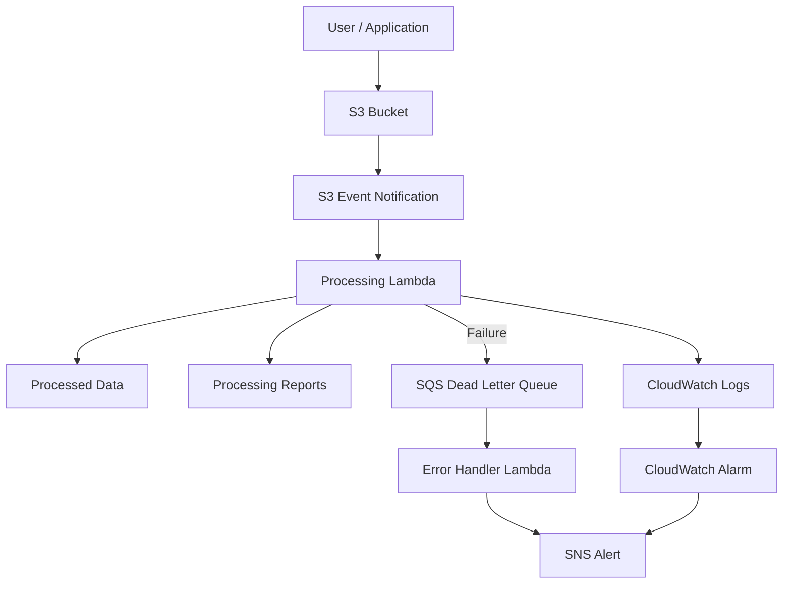

# Automated File Processing with S3 Events

A simple event-driven AWS project that automatically processes files uploaded to an S3 bucket.

This project uses **Amazon S3 event notifications** to automatically trigger **AWS Lambda** when a new file is uploaded to an S3 bucket.

Instead of polling the bucket manually or relying on scheduled jobs, S3 generates an event when a matching object is created. The event triggers the processing Lambda, which performs the required file-processing operations.

## How It Works

1. A file is uploaded to S3.
2. S3 detects the upload and triggers a Lambda function.
3. Lambda processes the file.
4. Logs are stored in CloudWatch.
5. If processing fails, the event is sent to an SQS Dead Letter Queue (DLQ).
6. An error-handling Lambda reads the failed event and sends an SNS notification.


## Architecture



## Event Filtering

S3 can trigger Lambda only for specific files.

For example:

```text
Prefix: incoming/orders/
Suffix: .csv
```

So a file like:

```text
incoming/orders/orders.csv
```

will trigger the Lambda, while unrelated files will not.

## Project Structure

```text
.
├── infrastructure/
│   ├── cloudwatch/
│   ├── iam/
│   ├── lambda/
│   ├── s3/
│   ├── sns/
│   ├── sqs/
│   ├── main.tf
│   └── variables.tf
│
├── src/
│   ├── data_processor/
│   │   └── handler.py
│   └── error_handler/
│       └── handler.py
│
└── README.md
```

## Error Handling

If the processing Lambda fails, the event can be sent to the SQS DLQ.

The error handler then processes the failed event and publishes a notification through SNS.

This prevents failed events from being lost and makes them easier to investigate.

## Monitoring

CloudWatch is used for Lambda logs and monitoring.

You can monitor things such as:

* Lambda errors
* Execution time
* Failed invocations
* Messages in the DLQ

## Deployment

### Prerequisites

* AWS account
* AWS CLI configured
* Terraform
* Python

### Deploy

```bash
cd infrastructure
terraform init
terraform plan
terraform apply
```

After deployment, upload a test file that matches the S3 event filter.

Example:

```text
incoming/orders/test.csv
```

Check the Lambda logs in CloudWatch to verify that the file was processed.

## Cleanup

To remove the infrastructure:

```bash
terraform destroy
```

## Summary

This project demonstrates a simple AWS event-driven pipeline using **S3, Lambda, SQS, SNS, and CloudWatch**.

Files are processed automatically when uploaded, with basic error handling and monitoring built in.
